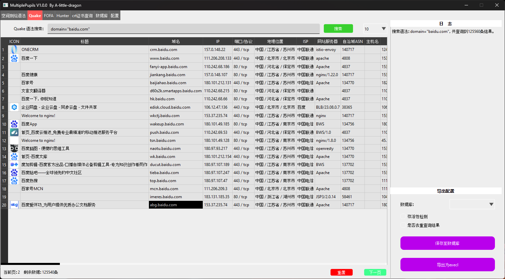

## MultiplePupils | 重瞳

### 0x01 工具描述

MultiplePupils 是TracelessSec团队开发的一款信息收集工具，主要用于红队渗透过程中网络空间资产收集，旨在方便渗透测试工程师的信息收集，并尽可能减少渗透过程中资产收集耗费的时间。

### 0x02 目前支持的功能

1. 支持对FOFA、Quake、Hunter等平台的查询功能。
2. 支持Crt.sh平台证书透明度查询
3. 资产测绘功能支持显示ICON图标，并且点击图标时，会复制该图标对应平台的语法。
4. 支持翻页查询，且之前记录会一直保留
5. 支持导出CSV格式文件

### 0x03 下载方式

支持免安装和安装两种方式：
1. 免安装版 ==> MultiplePupils.zip
2. 安装版 ==> MultiplePupils-windows-X64-setup.exe

### 0x04 版本规划

- MultiplePupils v1.1.0 
  - 将支持 其他测绘平台查询功能，并增加浏览器hacker语法查询

- MultiplePupils v1.2.0 
  - 将支持查询结果导入数据库功能，该功能主要用于特征资产监控清洗等等。

### 0x05 工具展示

